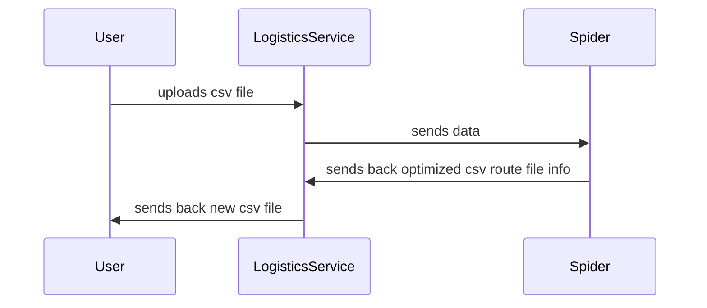

# Spec 
Our customers are really dependant of our systems to be able to do their deliveries. In order for them to do this in a best possible way we need to send their customers through a route optimization model which is a solution called Spider. In this case you will be given a CSV file containing all the latitude and longitude of the customers locations. These needs to be sent over to the optimization engine and obtained back, stored and returned to the customer in a good manner. Your choice of storage and how you process the file is optional (if you read file or send through an API i.e).
Your application is required to have the following features:

* Receive data from the file
* Send the coordinates to our optimization engine
* Evaluate the response limits and get the solution from optimization engine
* Store and present the data to a customer (no frontend needed to be built so API call is sufficient)
* Using Java, implement a RESTful API service to receive a data file with latitude, longitude. The service should connect to some sort of storage device to store the input data and to store the optimized data.

Some general things to consider:
Data modeling.
API design. How should it be presented in the API? Will it be easy to include more queries or extend the current ones to cater for new feature requests?
Would it be easier for other developers to get up-and-running if you use docker?
Testing approach. How would you approach it in your implementation?
Final result should consist of:
1. Source code with instructions on how to run it in a git repository we can access (Github, Bitbucket etc.) 2. A service deployed to a cloud provider of your choice using IaC approach.
   a. This is optional — only do it if you would like to demonstrate your DevOps skills.
   Technical details
   Documentation of the Spider optimization API:
   https://spider2.analytics-euw1-dev-1.eks.schibsted.io/swagger/index.html
   When you create a session you will need to send in some additional data besides deliveries, use the following JSON from input.json
   To be able to use Spider you will need to create a session, wait until it is ready. When optimization is running, you can check the bestSolutionValue, and choose to stop at your request.

## Docs

1. The input.json file contains car locations, their capacity, and when they will start driving
2. The input 

